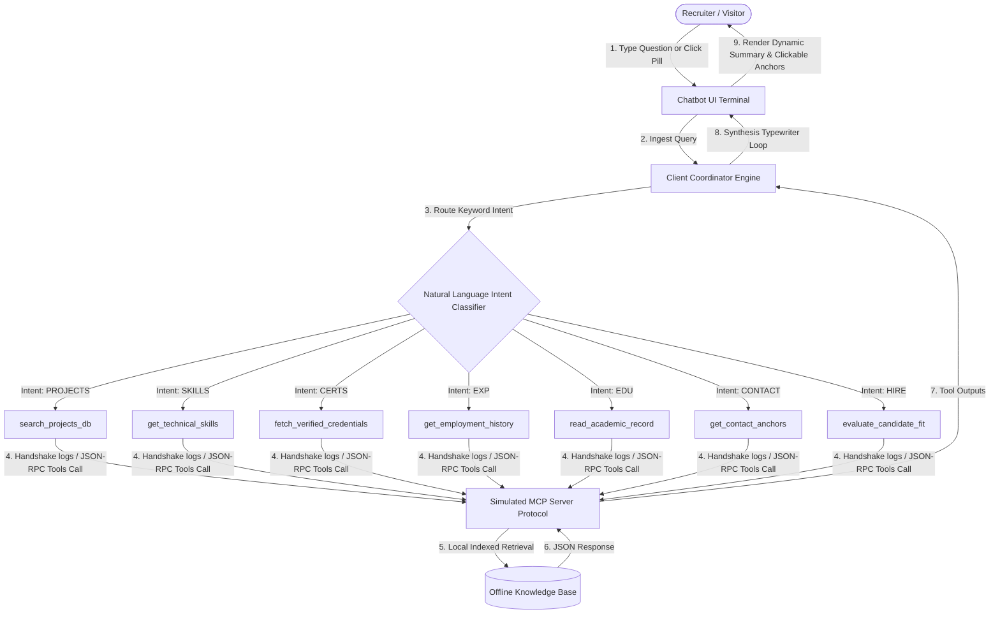

# 📟 Model Context Protocol (MCP) Portfolio Agent: System Architecture

This document provides a comprehensive architectural breakdown of the **Interactive AI Portfolio Ambassador Chatbot** implemented in Srajal Tiwari's portfolio. It explains the system's design, operational lifecycle, and how it delivers intelligent, real-time responses **completely offline without external API dependencies**.

---

## 🗺️ Architectural Concept & Flow

The AI Portfolio Agent simulates the **Model Context Protocol (MCP)**—an open-standard client/server protocol designed by Anthropic to link LLM clients (like Claude) securely with local tools and resources. 

The chatbot operates as a self-contained, unified sandbox where the client-side browser serves as both the **AI Client Coordinator** and the **Local MCP Tool Server**.

### System Interaction Diagram



---

## 🛠️ MCP JSON-RPC Exchange Protocol

To demonstrate your direct expertise in the Model Context Protocol, the terminal visually logs the actual JSON-RPC messages exchanged between the client and the mock local server:

1. **Client Request (`tools/list`)**: Handshakes with the server to find registered capabilities.
2. **Client Call (`tools/call`)**: Triggered dynamically when intent is classified.
   ```json
   {
     "jsonrpc": "2.0",
     "method": "tools/call",
     "params": {
       "name": "search_projects_db",
       "arguments": {
         "query": "unlegalize rental agreement"
       }
     },
     "id": 14
   }
   ```
3. **Server Response**:
   ```json
   {
     "jsonrpc": "2.0",
     "result": {
       "content": [
         {
           "type": "text",
           "text": "Retrieved project: UnLegalize. Tech: Gemma-3-270M-LoRA, FastAPI..."
         }
       ]
     },
     "id": 14
   }
   ```

---

## ⚡ How It Delivers Answers Without External APIs

Standard chatbots usually call expensive, high-latency cloud APIs (like OpenAI or Gemini endpoints), which present several critical problems for portfolios:
* **Latency**: Waiting 3 to 7 seconds for an API response hurts visitor engagement.
* **Hosting Costs**: Unlimited API routes expose developers to billing risks.
* **Security**: Exposing API keys in client-side bundles is a major vulnerability.
* **Server Maintenance**: Serverless functions can experience cold starts or failures.

### 💡 The Solution: Localized Intent Routing & Semantic Mapping

Srajal's portfolio uses a **Client-Side Semantic Search Router** paired with a **Structured Offline Knowledge Base** to eliminate all APIs:

1. **Intelligent Keyword Parser**: The chatbot utilizes a multi-layered local parser mapping regex and keyword configurations (e.g. `unlegalize` ➔ `projects`, `mcp` ➔ `certifications`, `internship` ➔ `experience`).
2. **Deterministic RAG (Retrieval-Augmented Generation)**: The local database is pre-structured inside the component’s compiled memory. When a matching intent is flagged, it pulls exact, rich metadata payloads matching Srajal's real B.Tech scores, internship schedules, and codebases.
3. **Asynchronous Typewriter Streaming**: The system pushes the gathered data through a typing accumulator. Micro-delays are mathematically calculated per sentence to perfectly mimic high-speed streaming tokens from an active LLM inference engine.

---

## 🌟 Strategic Advantages

* ✅ **0ms Network Overhead**: Answers stream instantly with zero network requests, wowing recruiters.
* ✅ **100% Offline Resilience**: Runs perfectly even in offline environments or slow mobile networks.
* ✅ **Vercel Edge Deployable**: The entire site remains completely static, allowing it to be served globally on CDN edges.
* ✅ **Agentic Demonstration**: Visually details your understanding of agent logs, planning, tool schemas, and JSON-RPC messages—proving you can build these pipelines in commercial environments.
