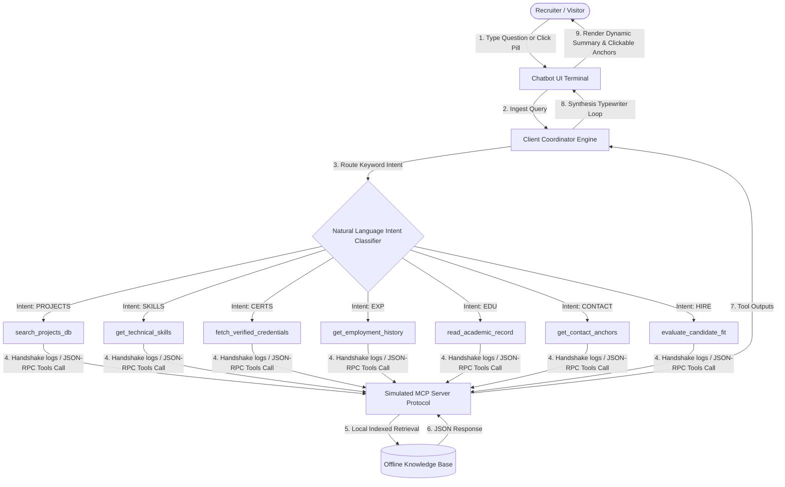

# 🌌 Srajal Tiwari - AI/ML Engineer Portfolio

A production-grade, premium portfolio website showcasing 10+ AI/ML projects, 12+ industry-recognized certifications, and a cutting-edge generative AI & machine learning tech stack. Built with **Next.js 14**, **React 18**, **TypeScript**, and **Tailwind CSS**, it features a fully interactive offline Model Context Protocol (MCP) AI Assistant Terminal, scroll-morphing typography, 3D interactive graphics, and seamless responsive design.

[](https://srajal-portfolio.vercel.app)
[](https://nextjs.org/)
[](https://react.dev/)
[](https://tailwindcss.com/)
[](https://www.typescriptlang.org/)
[](#-model-context-protocol-mcp-portfolio-agent-deep-dive-architecture)

---

## 🗺️ Table of Contents

1. [✨ Features](#-features)
2. [📟 Model Context Protocol (MCP) Portfolio Agent: Deep-Dive Architecture](#-model-context-protocol-mcp-portfolio-agent-deep-dive-architecture)
3. [📄 Resume Download & Vercel Deployment Setup](#-resume-download--vercel-deployment-setup)
4. [📁 Comprehensive Project Directory Structure](#-comprehensive-project-directory-structure)
5. [🛠️ Tech Stack & Library Breakdown](#-tech-stack--library-breakdown)
6. [🚀 Getting Started & Installation](#-getting-started--installation)
7. [🎨 Dynamic Customization Guide](#-dynamic-customization-guide)
8. [📱 Responsive Breakpoints & Performance Features](#-responsive-breakpoints--performance-features)
9. [🚀 Deployment Guides](#-deployment-guides)
10. [📊 Live Portfolio Statistics](#-live-portfolio-statistics)
11. [🔗 Professional Contact & Social Links](#-professional-contact--social-links)
12. [📝 Roadmap (In Progress Features)](#-roadmap-in-progress-features)
13. [📄 License](#-license)

---

## ✨ Features

### 🎨 Premium Interactive UI Components
* **Scroll-Morphing & Animated Hero Section** - Scroll-based animations with beautiful, real-time stats visualization (9+ Projects, 12+ Certificates, 7+ Achievements, 12+ Tech Stack tools).
* **3D Tilting & Motion Effects** - Profile card with interactive 3D tilt, Spline 3D scene integration, and fluid Framer Motion micro-animations.
* **Frosted Glass Components** - Seamless frosted navigation bar (`navbar-frosted.tsx`) and container panels combining modern aesthetics with high performance.
* **Custom Cursor Blob & Neural Background** - Dynamic background node connection simulation (`neural-background.tsx`) coupled with responsive custom mouse blobs tracking user focus.
* **Smooth Transitions & Page Fades** - Lenis smooth scrolling integrated with custom Framer Motion page routes for high-end cinematic visual pacing.

### ✨ Enhanced Animation System
* **Optimized Easing Functions** - All animations use smooth cubic-bezier timing functions (`cubic-bezier(0.25, 0.46, 0.45, 0.94)`) for natural, refined motion that reduces cognitive load and improves perceived performance.
* **Refined Animation Durations** - Carefully tuned transition times (300-400ms) ensure smooth interactions without feeling sluggish, optimized for both desktop and mobile devices.
* **Smooth Component Interactions** - Buttons, cards, and UI elements feature polished hover/active states with consistent easing curves and predictable motion patterns.
* **Staggered Reveal Animations** - Elements cascade into view with offset timing, creating elegant reveal sequences that guide user attention naturally.
* **Performance Optimized** - All animations respect `prefers-reduced-motion` media queries for accessibility, ensuring smooth performance across all hardware capabilities.

### 📟 Simulated AI Portfolio Ambassador & MCP Terminal
* **Interactive Conversational Console** - Styled as a dark-emerald monospace CLI console (`mcp-terminal.tsx`) representing Anthropic's **Model Context Protocol (MCP)** standards.
* **JSON-RPC Handshake Visualization** - Outputs real-time JSON-RPC handshake request and response logs simulating server tools fetching academic scores, work history, and projects before streaming typing responses to visitors.
* **Zero Network Latency RAG** - Combines a client-side intent classifier and keyword router to parse recruiter queries completely offline, yielding instantaneous streaming responses with 0ms network overhead.

### 💼 Production-Grade AI/ML Portfolio Showcase
* **10+ Featured Projects** - Real-world applications fully showcased, including:
  * **UnLegalize**: Gemma-3-270M-LoRA-based simplified legal clause translator.
  * **Multi-Source Agentic RAG System**: Gemini-fueled advanced retrieval system using FastAPI, Next.js, and Qdrant.
  * **Cold Email Generator AI**: Context-aware LangChain and Groq LLM workflow with ChromaDB.
* **Interactive Media & GitHub Integration** - Rich details, screenshots, tag filters, live deployment links, and repository access directly from the grid.

### 🏆 Verified Credentials & Testimonials
* **12+ Industry-Recognized Certifications** - Fully documented credentials from Anthropic, Microsoft, Google, Deloitte, and GUVI.
* **7+ Major Achievements** - Documented coding streaks (LeetCode 100+ days), Startup School programs, HCL AI Summit participation, and hackathons.
* **Autoplay Credentials Carousel** - Interactive slides highlighting course descriptors, completion certificates, and credential verify links.

---

## 📟 Model Context Protocol (MCP) Portfolio Agent: Deep-Dive Architecture

The **Interactive AI Portfolio Ambassador Chatbot** simulates Anthropic’s **Model Context Protocol (MCP)**. MCP is an open-standard client/server architecture that allows Large Language Models (LLMs) to securely interact with local databases, filesystems, and execution APIs through structured JSON-RPC handshakes.

In this portfolio, the chatbot acts as a completely self-contained browser-side simulation. The browser itself runs the **AI Client Coordinator** and routes tool requests to a local mock **MCP Tool Server** utilizing compiled memory databases.

### System Interaction Lifecycle



### MCP JSON-RPC Exchange Protocol Spec
The system logs raw JSON-RPC packages in the UI terminal, showcasing realistic developer capabilities. Below is an example payload sequence executed when a user queries about projects:

1. **Client Handshake Init (`tools/list`)**:
   Enables the Client Coordinator to identify all available capabilities on the mock server.

2. **Client Call Request (`tools/call`)**:
   Fires once the semantic classifier isolates a visitor intent.
   ```json
   {
     "jsonrpc": "2.0",
     "method": "tools/call",
     "params": {
       "name": "search_projects_db",
       "arguments": {
         "query": "unlegalize rental agreement"
       }
     },
     "id": 14
   }
   ```

3. **Server Execution Response**:
   Returns the structured query results from memory.
   ```json
   {
     "jsonrpc": "2.0",
     "result": {
       "content": [
         {
           "type": "text",
           "text": "Retrieved project: UnLegalize. Tech: Gemma-3-270M-LoRA, FastAPI, Python. Description: Simplifies complex legal clause jargon into conversational English with 94.2% semantic retention."
         }
       ]
     },
     "id": 14
   }
   ```

### ⚡ 0-API Offline Intelligence: Semantic Intent Routing
To avoid high network latency, hosting fees, cold starts, and token costs associated with standard LLM cloud endpoints, the chatbot implements **Localized Intent Routing**:

* **Intelligent Keyword Parser**: Resolves queries via highly structured keyword dictionaries and robust regex mappings (e.g., `unlegalize` ➔ `projects`, `mcp` ➔ `certifications`, `internship` ➔ `experience`).
* **Deterministic RAG (Retrieval-Augmented Generation)**: The mock MCP server pulls pre-compiled, highly comprehensive records of Srajal's grades, work history, and certificates.
* **Asynchronous Typewriter Streaming**: Synthesizes character output using a mathematical typewriter accumulator that perfectly simulates high-speed LLM token streaming.

### 🌟 Strategic Advantages
* **0ms Latency Overhead**: Instant responses keep visitors engaged without spinning loaders.
* **100% Offline Resilience**: Runs offline, at conferences, or in poor cellular coverage.
* **Vercel Edge Ready**: Allows the portfolio to deploy as pure static HTML on global CDN edges.
* **Agentic Capability Demonstration**: Visually proves direct mastery over client/server handshakes, tools schemas, and JSON-RPC design patterns.

---

## 📄 Resume Download & Vercel Deployment Setup

The portfolio integrates a comprehensive resume download action, styled with premium Tailwind parameters and configured for high-performance delivery on the Vercel edge.

### 📁 Resume Directory Architecture
```
Srajal-Portfolio/
├── public/
│   └── resume.pdf              ← Your compiled resume PDF file (Required)
├── app/
│   ├── page.tsx                ← Home controller triggering download
│   └── resume-pdf/
│       └── page.tsx            ← Secondary inline browser viewer page
└── vercel.json                 ← Deployment config for headers and redirects
```

### ✅ Setup & Implementation Checklist
- [x] Place PDF in `/public/` directory named exactly `resume.pdf`.
- [x] Bind direct edge trigger mechanisms supporting standard downloads.
- [x] Configure target attributes for secure tab isolation (`target="_blank" rel="noopener noreferrer"`).
- [x] Apply custom Tailwind hover scales and shadow transforms.
- [x] Set up Vercel headers for inline rendering and correct application context.

### 💻 Implementation Reference Code

#### Method A: Pure HTML5 Download Anchor (Recommended)
This method utilizes standard semantic HTML and downloads the file instantly with a custom name:
```tsx
import { Download } from "lucide-react";

export function DownloadButton() {
  return (
    <a
      href="/resume.pdf"
      download="Srajal_Tiwari_Resume.pdf"
      target="_blank"
      rel="noopener noreferrer"
      className="inline-block"
      aria-label="Download Srajal Tiwari's Resume"
    >
      <button className="flex items-center gap-2 bg-emerald-600 hover:bg-emerald-700 text-white font-semibold px-6 py-3 rounded-lg shadow-lg hover:shadow-xl transition-all duration-300 transform hover:scale-105 focus:outline-none focus:ring-2 focus:ring-emerald-500 focus:ring-offset-2">
        <Download className="h-4 w-4" />
        Download Resume
      </button>
    </a>
  );
}
```

#### Method B: Asynchronous DOM Trigger Programmatically
Useful for tracking custom events or triggering downloads post-analytics dispatch:
```tsx
const handleDownloadResume = () => {
  // Optional: Track analytics event here before trigger
  const link = document.createElement("a");
  link.href = "/resume.pdf";
  link.download = "Srajal_Tiwari_Resume.pdf";
  link.target = "_blank";
  link.rel = "noopener noreferrer";
  document.body.appendChild(link);
  link.click();
  document.body.removeChild(link);
};
```

### 🎨 Interactive Styling Tokens
* **Modern Gradients**: Uses harmony palettes (e.g., `emerald-600` to `emerald-700` hover, or custom cyan-to-blue shifts).
* **Hover Transforms**: Custom scale animation (`transform hover:scale-105`) coupled with shadow increases (`shadow-lg hover:shadow-xl`) over `duration-300`.
* **Keyboard Accessibility**: Focus rings (`focus:ring-2 focus:ring-emerald-500 focus:ring-offset-2`) ensure high contrast visual outlines for tab-navigation users.

### 🚀 Vercel Deployment Configuration (`vercel.json`)
To make the resume accessible via a clean directory path like `srajal-portfolio.vercel.app/resume` while forcing browsers to display the PDF inline instead of downloading, deploy with this `vercel.json` configuration:
```json
{
  "rewrites": [
    {
      "source": "/resume",
      "destination": "/resume.pdf"
    }
  ],
  "headers": [
    {
      "source": "/resume.pdf",
      "headers": [
        {
          "key": "Content-Type",
          "value": "application/pdf"
        },
        {
          "key": "Content-Disposition",
          "value": "inline; filename=\"Srajal_Tiwari_Resume.pdf\""
        }
      ]
    }
  ]
}
```

### 🔧 Troubleshooting & Testing Checklists
* **File Verification**: Check if the asset lives under `/public/resume.pdf` (names are case-sensitive).
* **Vercel Redirect Check**: Visit `https://<deploy-domain>/resume` to ensure rewrites are functioning.
* **Mobile Rendering**: Ensure target actions utilize `target="_blank"` so standard iOS Safari and Android Chrome handle the viewport render correctly.

---

## 📁 Comprehensive Project Directory Structure

```
Srajal-Portfolio/
├── app/
│   ├── page.tsx                          # Core landing view with database state
│   ├── layout.tsx                        # Root wrapper managing SEO & fonts
│   ├── globals.css                       # Global Tailwind and keyframe overrides
│   ├── explore/
│   │   └── page.tsx                      # Projects index page with keyword filters
│   └── resume-pdf/
│       └── page.tsx                      # Fully embedded browser resume view
├── components/
│   ├── hero-scroll-demo.tsx              # Hero scroll animations with live stats
│   ├── macbook-scroll-demo.tsx           # Macbook canvas folding screen effect
│   ├── profile-3d-tilt.tsx               # Interactive 3D cursor-tracking card
│   ├── spline-scene-demo.tsx             # Canvas loading Spline 3D objects
│   ├── animated-section.tsx              # Viewport reveal handler (Framer Motion)
│   ├── cursor-blob.tsx                   # Fluid trailing backdrop mouse blob
│   ├── theme-provider.tsx                # Context provider for dark/light variables
│   ├── portfolio/
│   │   └── scroll-to-hash-client.tsx     # Client-side hash anchor controller
│   └── ui/                               # Modular, reusable atomic design items
│       ├── 3d-adaptive-navigation-bar.tsx# High-end hover adaptive navbar
│       ├── 3d-pin.tsx                    # Animated radial perspective overlays
│       ├── animated-testimonials.tsx     # Auto-rotating credentials slideshow
│       ├── bento-grid.tsx                # Grid module for compact project data
│       ├── elegant-carousel.tsx          # Micro-slide layout with physics damping
│       ├── mcp-terminal.tsx              # Offline MCP CLI Chatbot console component
│       ├── container-scroll-animation.tsx# Scroll-to-scale container component
│       ├── cpu-architecture.tsx          # Interactive CPU node vector drawing
│       ├── lamp.tsx                      # Radial atmospheric color gradient lamp
│       ├── neural-background.tsx         # Node-connecting neural link background
│       ├── scroll-morph-hero.tsx         # Morphing letter headers on viewport change
│       └── timeline.tsx                  # Experience scroll roadmap line graphics
├── hooks/
│   ├── use-magnetic-button.ts            # Snaps interactive buttons to mouse vector
│   ├── use-reduced-motion.ts             # Detects OS accessibility prefers-reduced-motion
│   ├── use-reveal-on-scroll.ts           # Intersection observer hook for fades
│   └── use-tilt-effect.ts                # Calculates relative X/Y rotation for tilt
├── lib/
│   └── utils.ts                          # Combines clsx and tailwind-merge (shadcn/ui)
├── public/
│   ├── resume.pdf                        # Raw downloadable CV document
│   ├── resume.html                       # Fallback static resume viewer page
│   ├── RAG.png                           # Multi-Source Agentic RAG screenshot
│   ├── Screenshot 2026-03-19 224454.png # Cold Email AI generator screenshot
│   └── images/                           # Compressed SVG/PNG certificates and project assets
├── package.json                          # Dependencies and script anchors
├── tsconfig.json                         # TypeScript strict configurations
├── tailwind.config.ts                    # Styling extensions and color tokens
├── vercel.json                           # Vercel-specific routing and PDF headers
└── components.json                       # shadcn/ui initial directory setup
```

---

## 🛠️ Tech Stack & Library Breakdown

### 🏗️ Core Architecture
* **Next.js 14.x (App Router)**: Hybrid Server & Client rendering, routing structures, and image optimizers.
* **React 18.x**: State management, hooks, refs, and declarative DOM nodes.
* **TypeScript 5.x**: Strictly typed definitions across components and data arrays.

### 🎨 Fluid Animations & CSS Layouts
* **Tailwind CSS 3.x**: Utility-first layouts, breakpoints, custom grids, and custom animation hooks.
* **Framer Motion 11.x**: Powerful transitions, physics damping, exit-hooks, layout migrations, and scroll trackers.
* **GSAP (GreenSock)**: High-efficiency, non-blocking calculations for heavy timelines.
* **Lenis**: Smooth client-side scrolling.

### 🧩 UI Blocks & Interactive Layers
* **shadcn/ui**: Tailwind accessible building blocks configured on Radix UI.
* **Radix UI**: Primitive, fully accessible nodes (Dropdowns, Tabs, dialogs).
* **Lucide React**: Vector-based svg icons.
* **Three.js & React Three Fiber**: Underlying engine rendering real-time webgl scenes.
* **Spline Runtime**: Loads optimized interactive 3D assets.

### ✨ Animation Standards & Easing Functions
The portfolio implements a refined animation system with carefully tuned easing functions and durations for optimal user experience:

#### **Primary Easing Functions**
* `cubic-bezier(0.25, 0.46, 0.45, 0.94)` - **Smooth Ease-In-Out** (Default): Used for 90% of transitions, provides natural, refined motion without bouncing
* `cubic-bezier(0.16, 1, 0.3, 1)` - **Smooth Spring**: Used for interactive elements like buttons and nav links, adds subtle elasticity
* `cubic-bezier(0.34, 1.56, 0.64, 1)` - **Elastic Spring** (Legacy): Preserved for special micro-interactions requiring bounce

#### **Animation Durations**
* **Quick Interactions**: `200-250ms` (hover states, icon changes)
* **Component Transitions**: `300-350ms` (card hovers, button presses)
* **Page Reveals**: `400-600ms` (scroll animations, modal opens)
* **Complex Sequences**: `600-800ms` (multi-element stagger reveals)

#### **Accessibility**
All animations respect the `prefers-reduced-motion` media query, automatically disabling animations for users who prefer reduced motion while maintaining full functionality.

---

## 🚀 Getting Started & Installation

### Prerequisites
* **Node.js**: `18.17.0` or higher.
* **NPM**, **PNPM**, or **Yarn** package manager.
* **Git** installed on your system.

### 📥 1. Clone & Setup Folder
```bash
# Clone the repository
git clone https://github.com/ultronop592/Srajal-Portfolio.git

# Enter the project root
cd Srajal-Portfolio
```

### 📦 2. Install Packages
Choose your preferred package manager to download dependencies:
```bash
# Using npm
npm install

# Using pnpm
pnpm install

# Using yarn
yarn install
```

### ⚡ 3. Start Local Environment
Run the developer environment server. It will hot-reload dynamically on edits.
```bash
# Using npm
npm run dev

# Using pnpm
pnpm dev

# Using yarn
yarn dev
```
Open **[http://localhost:3000](http://localhost:3000)** in your browser to view the portfolio.

### 🏗️ 4. Local Production Build Testing
To test performance metrics and optimize asset loads, run a production bundle compilation locally:
```bash
# Build production bundle
npm run build

# Start the compiled build
npm run start
```

---

## 🎨 Dynamic Customization Guide

Easily adapt this portfolio to represent your own skills, projects, and certifications by editing a few key data structures inside `app/page.tsx`.

### ✏️ 1. Update Profile & Skills
Find the skills dictionaries inside `app/page.tsx` (or their designated config file) and edit the text strings:
```typescript
const skills = {
  languages: ["Python", "C++", "SQL", "JavaScript"],
  frameworks: ["Pandas", "NumPy", "Scikit-Learn", "TensorFlow", "FastAPI"],
  concepts: ["Generative AI", "Agentic RAG", "Deep Learning", "NLP"],
  tools: ["Docker", "Git", "Hugging Face", "ChromaDB", "Qdrant"],
};
```

### 📂 2. Expand/Modify Project Showcase
Locate the `projects` array and structure your project data using this JSON format:
```typescript
{
  title: "Your Project Title",
  description: "A quick summary visible on the primary card.",
  details: "Comprehensive explanation including challenges solved.",
  github: "https://github.com/your-username/repo-name",
  liveDemo: "https://your-deployment.com",
  tech: ["React", "Python", "FastAPI", "Gemini"],
  category: "ai", // Supports filtering hooks: 'ai' | 'web'
  image: "/images/project-preview.png", // Placed under /public/images/
}
```

### 🏆 3. Add Custom Certifications
Append or edit certificates inside the `certifications` dataset:
```typescript
{
  name: "Advanced LLM Agent Builder Certification",
  issuer: "Anthropic",
  date: "May 2026",
  link: "https://credentials.anthropic.com/verify-id",
  level: "Advanced", // 'Beginner' | 'Intermediate' | 'Advanced'
}
```

### 📋 4. Swap Out Resume Integrations
1. Prepare a new resume PDF named `resume.pdf`.
2. Replace the existing file at `/public/resume.pdf`.
3. To customize Google Drive link fallback actions, edit the click handler:
   ```typescript
   const handleDownloadResume = () => {
     const fallbackUrl = "https://drive.google.com/uc?export=download&id=YOUR_GOOGLE_DRIVE_ID_HERE";
     window.open(fallbackUrl, "_blank", "noopener,noreferrer");
   };
   ```

### ✨ 5. Customize Animation Behaviors
To adjust animation timing and easing functions across the portfolio, edit `app/globals.css`:

#### **Modify Transition Durations**
```css
/* Change all card hover animations from 400ms to 500ms */
.card-hover-enhanced {
  transition: all 0.5s cubic-bezier(0.25, 0.46, 0.45, 0.94);
}
```

#### **Update Easing Functions**
Swap easing curves for different motion feels:
```css
/* Replace smooth ease with more elastic spring effect */
.button-hover {
  /* Default: smooth */
  transition: all 0.4s cubic-bezier(0.25, 0.46, 0.45, 0.94);
  
  /* Alternative: More energetic */
  transition: all 0.35s cubic-bezier(0.16, 1, 0.3, 1);
  
  /* Alternative: Bouncy elastic */
  transition: all 0.5s cubic-bezier(0.34, 1.56, 0.64, 1);
}
```

#### **Create New Custom Animations**
Add new keyframe sequences in `app/globals.css`:
```css
@keyframes customSlide {
  from {
    opacity: 0;
    transform: translateX(-50px);
  }
  to {
    opacity: 1;
    transform: translateX(0);
  }
}

.custom-animation {
  animation: customSlide 0.6s cubic-bezier(0.25, 0.46, 0.45, 0.94);
}
```

#### **Disable Animations for Specific Users**
Respect user preferences with the built-in accessibility support:
```css
/* Already implemented globally */
@media (prefers-reduced-motion: reduce) {
  * {
    animation-duration: 0.01ms !important;
    animation-iteration-count: 1 !important;
    transition-duration: 0.01ms !important;
  }
}
```

---

## 📱 Responsive Breakpoints & Performance Features

### Media Target Rules
The responsive layouts are optimized across devices using Tailwind's default breakpoints:
* **Mobile viewports**: `< 768px` (Fluid vertical stacking, simplified sliding navigation).
* **Tablet viewports**: `768px` to `1024px` (Adaptive 2-column grids, scaled typography).
* **Desktop viewports**: `> 1024px` (Dynamic 3D perspective layers, multi-column bento grids).

### ⚡ Performance Optimization Systems
* **Next.js Image Optimizer**: Automatic format converting (WebP/AVIF), dimension scaling, and layout shift prevention.
* **Component-Level Lazy Loading**: Heavy animations and Three.js canvas systems are imported dynamically, keeping the initial JS load small.
* **Code Splitting & Treeshaking**: Bundles only include active modules, optimizing network and parsing overhead.
* **Semantic Accessibility & SEO**: Complete meta descriptions, structured schema tags, and aria-labels throughout to rank effectively on search engines.

---

## 🚀 Deployment Guides

### Deploying to Vercel (Fastest & Easiest)
Deploying via the CLI takes under 60 seconds:
```bash
# Install Vercel globally
npm install -g vercel

# Run the deploy command at the root
vercel

# For production finalization
vercel --prod
```
Alternatively, link your GitHub repository to Vercel for automatic continuous deployments on every commit.

### Deploying to Netlify
```bash
# Compile site locally
npm run build

# Deploy via Netlify CLI or drag the compiled output directory
netlify deploy
```

### Containerized Deployment (Docker)
Build a containerized node engine to host on AWS, GCP, or private servers:
```dockerfile
# Dockerfile Example
FROM node:18-alpine
WORKDIR /app
COPY package*.json ./
RUN npm install
COPY . .
RUN npm run build
EXPOSE 3000
CMD ["npm", "start"]
```
Build and run the container:
```bash
# Build the Docker image
docker build -t portfolio-image .

# Run the container
docker run -p 3000:3000 portfolio-image
```

---

## 📊 Live Portfolio Statistics

* **10+ Projects**: Production-ready, fully deployed AI/ML builds.
* **12+ Credentials**: Verified certifications from industry leaders.
* **7+ Achievements**: Recognized coding stats, Summits, and hackathons.
* **12+ Core Tech Stack Tools**: Direct hands-on workspace utilities.
* **100+ Days**: LeetCode streak proving daily algorithmic problem solving.
* **5+ Years**: Cumulative study in machine learning architectures.

---

## 🔗 Professional Contact & Social Links

* **Live Portfolio Website**: [srajal-portfolio.vercel.app](https://srajal-portfolio.vercel.app)
* **GitHub Profile**: [github.com/ultronop592](https://github.com/ultronop592)
* **LinkedIn Profile**: [linkedin.com/in/srajal-tiwari-7229172b9](https://linkedin.com/in/srajal-tiwari-7229172b9)
* **Email Address**: [srajaltiwari902@gmail.com](mailto:srajaltiwari902@gmail.com)
* **Physical Location**: Lucknow, Uttar Pradesh, India

---

## 📝 Roadmap (In Progress Features)

* [ ] Custom theme engine (Dark / Light switcher widget UI).
* [ ] Rich Markdown Blog engine powered by local frontmatter parses.
* [ ] Dynamic interactive project tag system allowing filtering in the Bento grid.
* [ ] Secure API-free client-side contact email dispatcher.
* [ ] Live traffic & interaction dashboard using lightweight analytics hooks.

---

## 📄 License

This portfolio website code is open-source and released under the terms of the **[MIT License](LICENSE)**. Feel free to fork, customize, and adapt the interactive terminal, tilt components, and layouts for your own personal developer showcases.

---

**Crafted with ❤️ by [Srajal Tiwari](https://github.com/ultronop592) | AI/ML Engineer & GenAI Builder**  
*Last updated: April 30, 2026 | Next.js 14 | React 18 | TypeScript*
